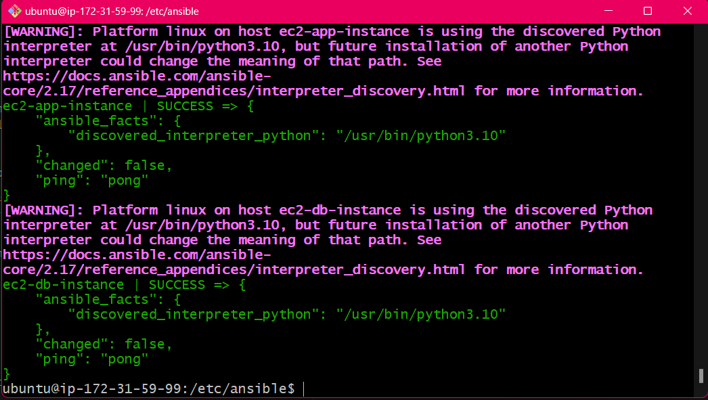
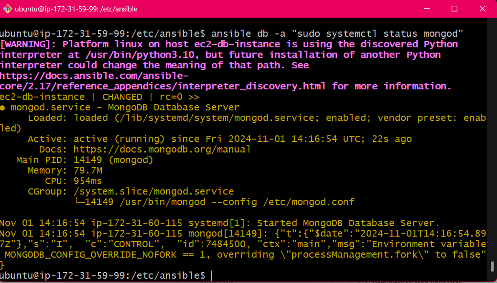

# ***ANSIBLE***
- [***ANSIBLE***](#ansible)
  - [***Create an ansible controller and app \& db ec2 instance***](#create-an-ansible-controller-and-app--db-ec2-instance)
    - [***Ansible Controller EC2***](#ansible-controller-ec2)
    - [***Target Node -  App EC2***](#target-node----app-ec2)
    - [***Database EC2***](#database-ec2)
  - [***Next Steps***](#next-steps)
  - [***Use Ad-Hoc command to transfer key to target node***](#use-ad-hoc-command-to-transfer-key-to-target-node)
  - [***Create a playbook to provision the app and db EC2 instances***](#create-a-playbook-to-provision-the-app-and-db-ec2-instances)
  - [***Copying a file using the copy module***](#copying-a-file-using-the-copy-module)
  - [***Create a master playbook***](#create-a-master-playbook)
    - [***Possible blockers***](#possible-blockers)

## ***Create an ansible controller and app & db ec2 instance***
### ***Ansible Controller EC2***
1. go to the aws portal and create an ec2 instance with the name **`tech264-ilhaan-ubuntu-2204-ansible-controller`**
2. Use Ubuntu Pro 22.04 
3. Enable the SSH port
4. Use your existing aws key
5. No need to run any scripts or user data
---
### ***Target Node -  App EC2***
1. go to the aws portal and create an ec2 instance with the name **`tech264-ilhaan-ubuntu-2204-ansible-target-node-app`**
2. Use Ubuntu Pro 22.04 
3. Enable the SSH, HTTP & port 3000
4. Use your existing aws key, the same one you used for the controller
5. No need to run any scripts or user data
---
### ***Database EC2***
1. go to the aws portal and create an ec2 instance with the name **`tech264-ilhaan-ubuntu-2204-ansible-node-db`**
2. Use Ubuntu Pro 22.04 
3. Enable the SSH
4. Use your existing aws key, the same one you used for the controller
5. No need to run any scripts or user data

- check you can ssh into all the machines

## ***Next Steps***
 
1. When they're both created, we **`sudo apt-get update -y`** and **`sudo DEBIAN_FRONTEND=noninteractive apt-get upgrade -y`** both of our VMs.
2. Go to the controller VM window and insert the command **`sudo apt-add-repository ppa:ansible/ansible`** to install the ansible repo, followed by **`sudo apt install ansible -y`**
3. Check the version for clarity.
4. CD into **`/etc/ansible`** folder.
5. Use **`ansible all -m ping`** to ping all the machines that Ansible knows to communicate with. If there are none, use **`sudo nano hosts`** once in the **`/etc/ansible`** directory to add some.
6. Add this to the top of the file:
 
```yaml
[web]
# where the app servers will go
ec2-app-instance ansible_host=[db-public-ip] ansible_user=ubuntu ansible_ssh_private_key_file=~/.ssh/tech264-name-aws-key.pem
```
This will then allow the ping function to work.
 
*Note! We can also put a ***`[db]`*** group to specify database dervers.*
 

 Here is how I've reconfigured the hosts file to connect to the db ec2:
 ```yaml
[db]
# where the db servers will go
ec2-db-instance ansible_host=[app-public-ip] ansible_user=ubuntu ansible_ssh_private_key_file=~/.ssh/tech264-ilhaan-aws-key.pem
 ```
- this should be the result when you run the **`ansible all -m ping`** command, you should get a response from both machines



<br>

8. To put these in a parent group, we set them up like so:
 
```yaml
[test:children]
web
db (if we made the group)
```
 
This means we could ping the **`test`** group and get responses from all their children.
 
*⚠️ 8. This will be in the exam! ⚠️*
 
**Helpful commands:**
- We can use **`ansible-inventory --list`** to check groups we've made. Replace **`--list`** with **`--graph`** to see it in a tree-like format.
- **`ansible web -a (group name or all)`** can be used to run a command on a particular machine, or all of them.
 
9. Insert **`sudo nano install_nginx.yaml`** to create a yaml file.
10. In the file, insert this:
 
```yaml
# Starts with --- (three hyphens)
---
 
# Name of the play
- name: install nginx play
  # Where - on which devices - run this playbook
  hosts: web
 
  # Get comprehensive facts on the hosts / devices
  gather_facts: yes # If you want the playbook to run faster, turn this off using "no"
 
  # Do we need to provide admin access? Use sudo
  become: true
 
  # Instructions for this play, known as "tasks"
  # First Task: Install nginx on the Target Node
  tasks:
  - name: install and configure nginx
    # Use "nginx" package // "state=present" means we are checking that is it downloaded
    apt: pkg=nginx state=present
```
   - **[install nginx script](./install_nginx.yaml)** can be edited here
1.  We can use `ansible-playbook install_nginx.yaml` to activate the playbook. This should mean that **`nginx`** is installed and running.
  
## ***Use Ad-Hoc command to transfer key to target node***
```yaml
ansible ec2-app-instance -m ansible.builtin.copy -a "src=~/.ssh/tech264-name-aws-key.pem dest=/home/ubuntu/.ssh/tech264-name-aws-key.pem mode=0400"
```

  - ec2-app-instance: The name of your target node in your Ansible inventory. 
  - **`-m ansible.builtin.copy`**: Specifies the copy module from the ansible.builtin collection.
  - **`-a "src=~/.ssh/tech264-name-aws-key.pem dest=/home/ubuntu/.ssh/tech264-name-aws-key.pem mode=0600"`**:
    - **`src`**: Path to the private key on the Ansible controller.
    - **`dest`**: Full path on the target node where the key will be copied.
    - **`mode=0400`**: Sets secure file permissions so that only the owner can read the file.


## ***Create a playbook to provision the app and db EC2 instances***

1.  create a **YAML** file named **`prov_app_with_npm.yaml`** in your **`/etc/ansible/`** directory
2.  Use modules to ensure idempotency, meaning there are no unwanted side effects due to repeated executions
3.  We want to create a script that installs NodeJS and NPM install as well as clones your **`tech264-sparta-app`** github repo
4.  this **[script](./scripts/prov_app_with_npm_start.yaml)** describes the code I used to copy the github repo and get the app running on port 3000 with nodejs
5.  create a YAML file with the name **`prov_app_with_pm2.yaml`** in the same directory
6.  this **[script](./scripts/prov_app_with_pm2.yaml)** descirbes the same but with pm2 instead of npm
7.  edit the **[script](./scripts/configure_nginx.yaml)** so that it configures nginx reverse proxy so the app runs on port 80 instead of port 3000, add this to the script that provisions the app
8.  This **[script](./scripts/install_mongodb.yaml)** downloads and runs mongodb on the database ec2
9.  create a [script](./scripts/prov-db.yaml) to provision the database ec2 instance
10. Check the bindIP has been configured using **`ansible db  -a "grep 'bindIp' /etc/mongod.conf"`**
11. On the App VM, manually create an ENV VAR DB_HOST. Check it's been made and restart the app.
12. In the app target node:
```bash
export DB_HOST="mongodb://{DBPRIVATEIP}:27017/posts"
cd repo/app
sudo -E npm install
```
13.   you should now be connected to your mongodb database, check if the script is running correctly by using **`ansible db -a "sudo systemctl status mongod"`**
<br>



<br>

## ***Copying a file using the copy module***
```yaml
---
- name: Copy testfile.txt from home directory to the target node
  hosts: web
  tasks:
    - name: Copy testfile.txt to the target node
      ansible.builtin.copy:
        src: /home/ubuntu/testfile.txt
        dest: /home/ubuntu/testfile.txt
```


## ***Create a master playbook***
1. Import your two working playbooks and run them in a master-playbook made and named `sudo nano master-playbook.yaml`
2. Find the **[script](./scripts/master-playbook.yaml)** here


### ***Possible blockers***
-  ensure you are using the correct **aws key** from your **/.ssh folder**
- make sure the variable name **`ansible_ssh_private_key_file`**
- specify the correct **nodejs** version (version 20)
- using the below command means you need to use sudo priveleges throughout
```yaml
become: true
```